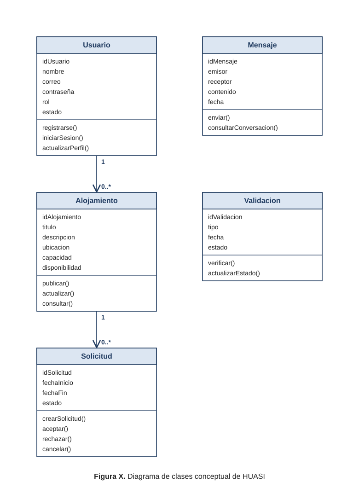
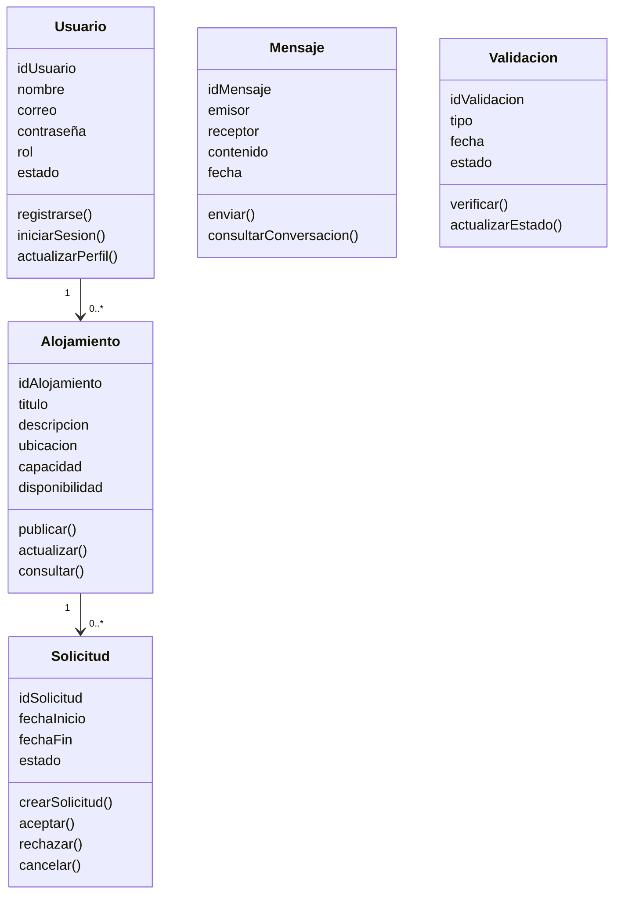

# Figura X. Diagrama de clases conceptual de HUASI

## Versión Mermaid (editable)

```mermaid
classDiagram
    direction TB

    class Usuario {
        idUsuario
        nombre
        correo
        contraseña
        rol
        estado
        registrarse()
        iniciarSesion()
        actualizarPerfil()
    }

    class Alojamiento {
        idAlojamiento
        titulo
        descripcion
        ubicacion
        capacidad
        disponibilidad
        publicar()
        actualizar()
        consultar()
    }

    class Solicitud {
        idSolicitud
        fechaInicio
        fechaFin
        estado
        crearSolicitud()
        aceptar()
        rechazar()
        cancelar()
    }

    class Mensaje {
        idMensaje
        emisor
        receptor
        contenido
        fecha
        enviar()
        consultarConversacion()
    }

    class Validacion {
        idValidacion
        tipo
        fecha
        estado
        verificar()
        actualizarEstado()
    }

    Usuario "1" --> "0..*" Alojamiento
    Alojamiento "1" --> "0..*" Solicitud
```
